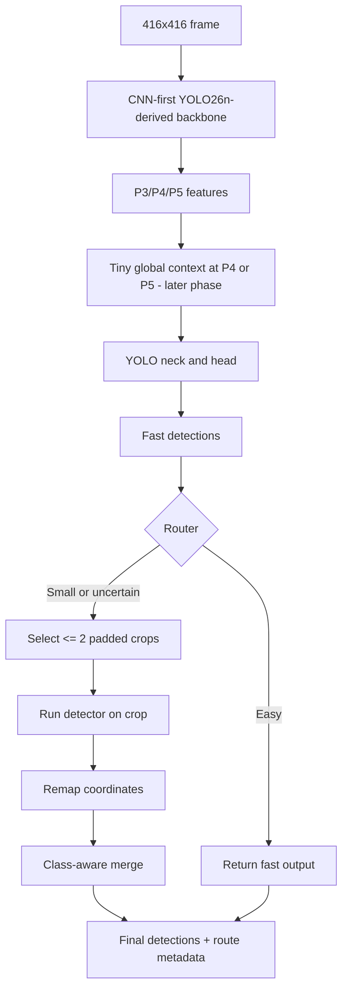

# Architecture Diagram

```mermaid
flowchart TD
    A[416x416 frame] --> B[CNN-first YOLO26n-derived backbone]
    B --> C[P3/P4/P5 features]
    C --> D[Tiny global context at P4 or P5 - later phase]
    D --> E[YOLO neck and head]
    E --> F[Fast detections]
    F --> G{Router}
    G -->|Easy| H[Return fast output]
    G -->|Small or uncertain| I[Select <= 2 padded crops]
    I --> J[Run detector on crop]
    J --> K[Remap coordinates]
    K --> L[Class-aware merge]
    L --> M[Final detections + route metadata]
    H --> M
```

## Phase note

During AegisDet-Mini, the global-context node is absent. It is added only in Phase 4.
